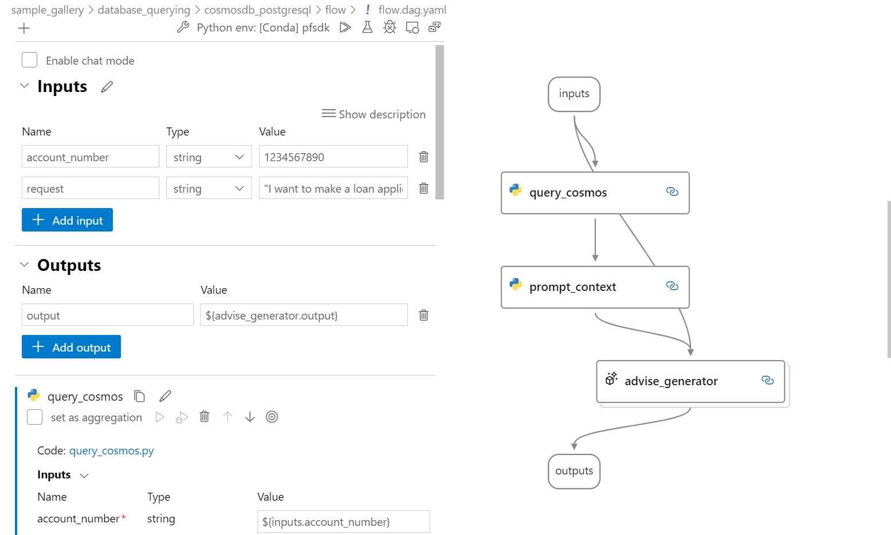
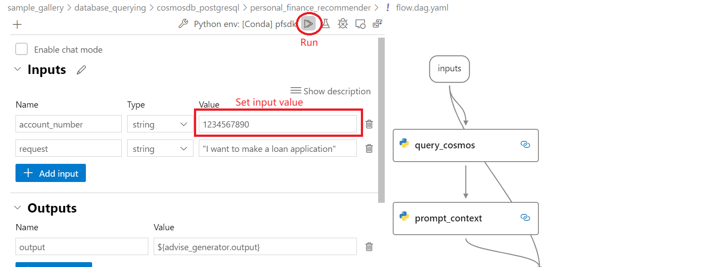

# Personalized Financial advise using banking customer data on PostgreSQL/CosmosDB

Customer data stored in operational databases will be useful to enrich context for LLM generations. In this post we will generate personalized financial advise to banking customers using their data stored in a database. We will use PromptFlow for LLM app development and postgresql / cosmosdb for storing customer data.

Prompt flow, a new service within Azure ML suite of services, tries to address challenges with LLM App development. Main benefit is that prompt flow brings together LLM’s, 3rd party API’s, OS models, tools for prompt engineering and to evaluate prompt/model variants.

* [Open-sourced prompt flow](https://github.com/microsoft/promptflow)
* [Prompt flow cloud - Azure Machine Learning](https://learn.microsoft.com/en-us/azure/machine-learning/prompt-flow/overview-what-is-prompt-flow?view=azureml-api-2)

In this tutorial we will use prompt flow open-sourced version, which is the pure local tool, to build a LLM-app that generates personalized financial advise to banking customers. We will use postgresql / cosmosdb for storing customer data -- *banking customers*, and query the database from prompt flow to enrich context for LLM generations.

## PostgreSQL/CosmosDB setup

[Azure Cosmos DB for PostgreSQL](https://learn.microsoft.com/en-us/azure/cosmos-db/postgresql/) is a managed service for PostgreSQL extended with the [Citus open source](https://github.com/citusdata/citus) superpower of distributed *tables*.

To create a PostgreSQL database on Azure, you can:
1. Go to Azure portal, select `Create` to create the Azure resource in your subscription. Then s
1. Select the `Azure Cosmos DB` resource type, select `PostgreSQL`.
1. Then you can follow the [Create an Azure Cosmos DB for PostgreSQL cluster in the Azure portal](https://learn.microsoft.com/en-us/azure/cosmos-db/postgresql/quickstart-create-portal?tabs=direct) tutorial to complete the resource configuration as your needs.


## Database setup

In our imaginary scenario we will integrate customer data stored in Cosmosdb / PostgreSQL with GPT models to generate financial advise for a customer intended task e.g. loan application, debt repayment.

After creating a cosmosdb instance on Azure we will create a customer banking db under postgresql / cosmosdb and upload banking data to it. GPT4 proves to be very useful in generating synthetic data, more on how to generate dataset using LLM you can refer to [Golden dataset](../../golden_dataset/copilot-golden-dataset-creation-guidance.md).

I simply used ChatGPT to create synthetic data for a banking customer database which will include data that can be used for financial advise such as “average_monthly_deposit”, “average_monthly_withdrawal”, “risk_tolerance”, “financial_goal” etc. I then copy ChatGPT generated synthetic data to a [data.csv](./source_file/data.csv) file and uploaded it to Cosmosdb/PostgreSQL database running on AzureI created earlier with a simple **df.to_sql** statement.

You can run code cells in the [cosmosdb_setup.ipynb](./source_file/cosmosdb_setup.ipynb) notebook to complete database setup:

1. Check the banking customer data file `data.csv`.
1. Connect to your PostgreSQL CosmosDB database.
1. Upload the data to the database.

By checking the data samples in the data file, you can see that the data is in the following format:

```shell
Index(['id', 'account_number', 'account_type', 'balance',
       'account_holder_name', 'date_of_birth', 'employment_status',
       'creation_date', 'interest_rate', 'branch_id', 'overdraft_limit',
       'currency', 'last_transaction_date', 'average_monthly_deposit',
       'average_monthly_withdrawal', 'financial_goal', 'goal_amount',
       'risk_tolerance'],
      dtype='object')

Sample data 
id,account_number,account_type,balance,account_holder_name,date_of_birth,employment_status,creation_date,interest_rate,branch_id,overdraft_limit,currency,last_transaction_date,average_monthly_deposit,average_monthly_withdrawal,financial_goal,goal_amount,risk_tolerance
1,1234567890,Checking,5000.00,John Doe,1980-06-01,Employed,2023-01-01,1.00,101,500.00,USD,2023-07-30,2500.00,2000.00,Retirement,1000000.00,Medium
2,2345678901,Savings,7000.00,Jane Doe,1985-12-12,Self-employed,2023-02-01,2.00,102,1000.00,USD,2023-07-25,3000.00,1500.00,Buy a House,300000.00,Low
```

After the dataset uploaded to the database, you can connect to your postgresql instance with `psql`, then run query to check the data. For example:

1. Copy the psql connection string to your terminal and connect to the db.
    

    ```shell
    psql -h c-db-ozguler.XXXXX.postgres.cosmos.azure.com -d citus -U citus -p 5432
    ```
1. Run query to check the data.

    ```shell
    citus=> SELECT * FROM bank_accounts;
    ```

    

## Connection setup in prompt flow

Create a prompt flow **custom connection** to connect to cosmosdb PostgreSQL database.

The custom connection creation in prompt flow is based on the yaml file specification on the `key:value` of your authentication information to call the database. You can refer to the [prompt flow connection](https://microsoft.github.io/promptflow/how-to-guides/manage-connections.html#create-a-connection).

In this tutorial, we provide the template [conn.yaml](./source_file/conn.yaml), which have the following format keys for consuming the CosmosDB PostgreSQL database:

```yaml
$schema: https://azuremlschemas.azureedge.net/promptflow/latest/CustomConnection.schema.json
name: cosmos
type: custom
configs:
  endpoint: "<your-endpoint>"
  database: "citus"
  username: "citus"
  port: "<your-port>"
secrets:
  password: "<user-input>"

```

The value of these keys you can find in the connection string of your cosmosdb instance. For example:


- endpoint: behind of the `host=` (e.g. `c-db-ozguler.XXXXX.postgres.cosmos.azure.com`).
- port: behind of the `port=`.
- database: behind of the `dbname=`.
- username: behind of the `user=`.
- password: behind of the `password=`.

You can run the following command to create the connection:

```shell
cd ./sample_gallery/database_querying/cosmosdb_postgresql/source_file
pf connection create -f ./conn.yaml --set configs.endpoint=<your-endpoint> configs.port=<your-port> secrets.password=<your-password>
```

## Local environment setup

For the SQL API for cosmos the environment will require `azure-cosmos` pip installed so that you can use the cosmos db custom prompt flow connection within your python code.

However since we are using the postgresql citus API we will need to install the required **ODBC drivers** and other required packages to your local machine environment. For Linux, you can set up the environment with the following steps:

1. Install system packages required for **pyodbc**

    ```shell
    apt-get update \
    && apt-get install -y --no-install-recommends \
    gcc \
    g++ \
    unixodbc-dev \
    && apt-get clean \
    && rm -rf /var/lib/apt/lists/*
    ```

1. Install **PostgreSQL ODBC Driver**
      
    ```shell
    apt-get update && apt-get install -y \
    curl \
    gnupg \
    && curl https://www.postgresql.org/media/keys/ACCC4CF8.asc | apt-key add - \
    && echo "deb http://apt.postgresql.org/pub/repos/apt/ buster-pgdg main" > /etc/apt/sources.list.d/pgdg.list \
    && apt-get update \
    && apt-get install -y odbc-postgresql \
    && apt-get clean \
    && rm -rf /var/lib/apt/lists/*
    ```

1. Install required packages defined in [requirements.txt](./source_file/image_build/requirements.txt)

    ```shell
    cd ./sample_gallery/database_querying/cosmosdb_postgresql/source_file/image_build
    pip install -r requirements.txt
    ```

In this tutorial, we also provide a [Docker file](./source_file/image_build/Dockerfile) to do that.

## Develop a flow to generate financial advise based on customer data query from cosmosdb PostgreSQL

In this tutorial, we've prepared such a sample flow to generate financial advise based on specfic customer's asked question and his data queried from the CosmosDB PostgreSQL. You can access the structure difiniton file of the flow in [flow.dag.yaml](./flow/flow.dag.yaml) in the [personal_finance_recommender](./personal_finance_recommender/) folder.

By utilizing the Prompt Flow VS Code extension, you can view this flow in a visual editor, should look like this:



The flow has 2 input parameters:
* `account_number`: the identity of the customer storing in the database.
* `request`: the question asked by the customer.

The flow has 3 nodes:
* `query_cosmos`: the python node to connect to the cosmosdb PostgreSQL database and query the customer data selecting by the account_number.
* `prompt_content`: the python node to combine the queried customer data and the sepecific question of each field to be the prompt for the LLM to generate the financial advice.
* `advice_generator`: the LLM node to generate the financial advice based on the prompt.

## Run the flow to have a test

With the promptflow package installed, you can perform a single test on the flow by running the following command:

```shell
cd ./sample_gallery/database_querying
pf flow test --flow ./personal_finance_recommender --inputs account_number="1234567890" request="What is the best way to save money?"
```
Alternatively, you can also run the flow through the Visual Studio Code extension.

1. Open the [flow.dag.yaml](./sk_planner_flow/flow.dag.yaml) and switch to the visual editor.
1. Check the **Inputs** section, then click the **Run** button to run the flow.



A sample generation result should look like this:

```shell
"output":"Subject: Comprehensive Financial Plan for John Doe's Loan Application Dear John Doe, Thank you for reaching out for assistance with your financial goals and loan application. Based on the detailed financial profile you provided, I have prepared a comprehensive financial plan that aligns with your long-term goals, 
risk tolerance, and current financial standing. Please find the plan outlined 
below. 1. Personalized Advice for Different Age Groups or Life Situations: 
- Considering your current goal of retirement, it is essential to start saving 
and investing early to take advantage of compounding returns. However, 
regardless of age, the principles of diversification and risk management remain
 crucial. I will factor in your age to determine an appropriate asset allocation
 strategy. 2. Account Type - Checking Account: - While a checking account
 provides liquidity and flexibility for day-to-day transactions, it may not 
align with your long-term financial objectives. I recommend opening additional 
accounts, such as a savings account or investment account, to allocate funds 
for specific purposes and potential growth. 3. Strategies for Maximizing the 
Value of Current Balance: - With a current balance of $5000, it is advisable 
to allocate a portion of this balance towards emergency funds as a safety net.
 I recommend setting aside 3-6 months' worth of living expenses in a high-yield
 savings account. This ensures you have access to funds in case of unexpected 
expenses or job loss. 4. Employment Status - Employed: - Your employment status
 provides a stable income source, allowing you to allocate a portion of your 
monthly earnings towards savings and investments. I will incorporate your 
mployment status into the financial plan to determine an appropriate savings 
rate and investment strategy. 5. Allocation of Average Monthly Deposit - $2500:
 - As a general guideline, I recommend allocating a certain percentage of your 
monthly deposit towards investments, savings, and emergency funds. Considering your medium risk tolerance, I suggest allocating 70% ($1750) towards investments, 20% ($500) towards savings, and 10% ($250) towards emergency funds. 6. Methods to Minimize Unnecessary Withdrawals: - To minimize unnecessary withdrawals, it is crucial to create a budget and stick to it. 
By tracking your expenses and prioritizing needs over wants, you can reduce the likelihood of making unnecessary withdrawals. 
Additionally, establishing an emergency fund will help cover unexpected expenses without tapping into your investment portfolio. 
7. Steps for Achieving Financial Goal - Retirement: - Short-term steps: - 
Review your current retirement savings and assess if they are on track to meet 
your desired retirement income. - Maximize contributions to tax-advantaged 
retirement accounts, such as a 401(k) or IRA, to take advantage of potential 
employer matches and tax benefits. - Consider working with a financial advisor 
to develop a retirement savings plan tailored to your specific goals and risk 
tolerance. - Long-term steps: - Regularly review and adjust your investment 
portfolio to ensure it aligns with your changing financial circumstances and 
risk tolerance. - Continuously increase your retirement savings contributions 
as your income allows. - Explore additional retirement savings vehicles, such 
as annuities or real estate investments, to diversify your retirement income sources. 8. Investment Opportunities based on Medium Risk Tolerance: - Given your medium risk tolerance, a balanced investment approach is recommended. This may include a combination of stocks, bonds, and other asset classes to achieve a diversified portfolio. - Investment options to explore include low-cost index funds, mutual funds, or exchange-traded funds (ETFs) that offer exposure to broad market indices. - Avoid high-risk investments, such as individual stocks or speculative ventures, that may not align with your risk tolerance. Please note that this plan serves as a general guideline and should be customized to your specific financial situation. It is advisable to consult with a financial advisor who can provide personalized recommendations tailored to your needs. I hope this comprehensive financial plan provides you with a solid foundation for achieving your financial goals and supports your loan application. Should you have any further questions or require additional assistance, please feel free to reach out. Best regards, [Your Name] [Your Title] [Contact Information]"
}
``````