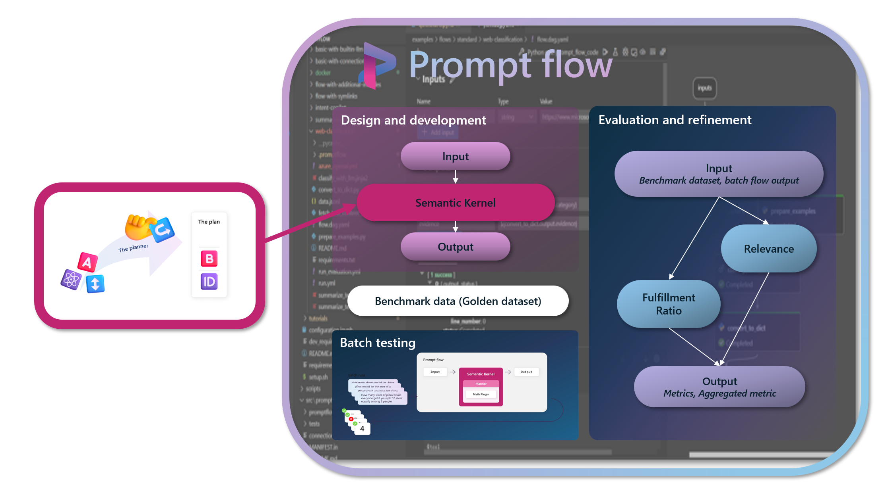
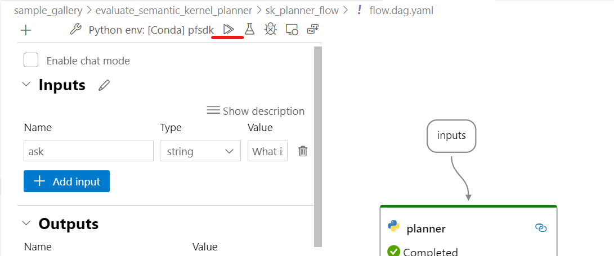
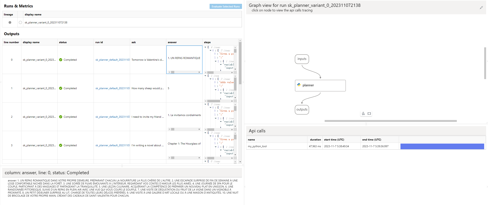
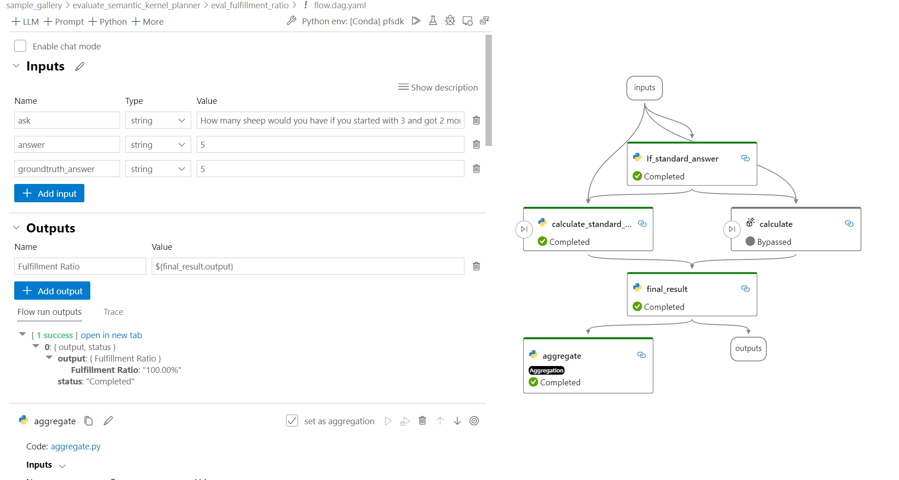
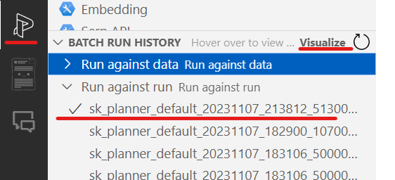
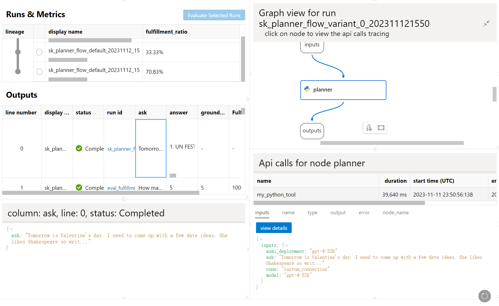

# Tutorial: Evaluate Semantic Kernel Planner

## Overview

In the fast-paced realm of AI orchestration, as the incorporation of more plugins into planners occurs, ensuring their proper operation becomes paramount. Previously, this was a labor-intensive and time-consuming process, but now, with the introduction of prompt flow, you can automate this procedure.

This is where the integration of [semantic kernel](https://github.com/microsoft/semantic-kernel) and [prompt flow](https://github.com/microsoft/promptflow) comes. It not only facilitates automatic orchestration of functions in real-time using the planner, but also allows for comprehensive evaluation of your semantic kernel plugins and planners. This ensures higher levels of quality control and fine-tuning.



In this tutorial, we guide you on how to:

* Develop a flow: we provide a sample flow that showcases how the semantic kernel planner could run in prompt flow.
* Benchmark dataset preparation: You can utilize the [Golden dataset](../golden_dataset/copilot-golden-dataset-creation-guidance.md) as a basis for preparing your benchmark dataset.
* Execute batch tests: we guide you through the prompt flow batch test process, demonstrating how to generate output from your multi-row dataset.
* Conduct evaluations: finally, we introduce an evaluation flow that illustrates how to quantitatively assess the *fulfillment ratio* of your planners.

By following this tutorial, you will gain a practical understanding of the Semantic Kernel Planner and how to effectively incorporate it with Prompt Flow.
By following this tutorial, you will gain a hands-on understanding of evaluating semantic kernel planner with prompt flow.

## Prerequisites

To go through this tutorial you should:

1. Install dependencies
    ```bash
    cd ./sample_gallery/evaluate_semantic_kernel_planner/source_file
    pip install -r requirements.txt
    ```

2. (Optional but highly recommended) Install and configure [Prompt flow for VS Code extension](https://marketplace.visualstudio.com/items?itemName=prompt-flow.prompt-flow) follow [Quick Start Guide](https://microsoft.github.io/promptflow/how-to-guides/quick-start.html). 

    💡 This extension is optional but highly recommended for flow development and debugging.

## Develop a flow with semantic kernel planner

If you've already familiarized yourself with the process of [create a prompt flow from scratch](https://microsoft.github.io/promptflow/how-to-guides/quick-start.html), incorporating a semantic kernel planner within the prompt flow should be a straightforward task. All semantic kernel python code can be executed in the **Python node** of the prompt flow.

In this tutorial, we've prepared a sample flow to help you get started. You can access the flow file [flow.dag.yaml](./sk_planner_flow/flow.dag.yaml) in the [sk_planner_flow](./sk_planner_flow) folder.

- [flow.dag.yaml](./sk_planner_flow/flow.dag.yaml): This YAML file defines the flow, detailing the input, output, and linking relationship of the nodes.
    - The flow incorporates a semantic kernel planner node (Python). The entry point for the planner is the [sk_planner.py](./sk_planner_flow/sk_planner.py) file.
- [skills](./sk_planner_flow/skills/): This folder contains the Semantic Kernel custom plugin files.

y utilizing the Prompt Flow VS Code extension, you can view this flow in a visual editor:

1. Open this repository in VS Code.
1. Activate the conda environment where the `promptflow` package is installed.
1. Open the [flow.dag.yaml](./sk_planner_flow/sk_planner_flow.yaml) file in the VS Code extension.
1. Click on the **visual editor** button at the top.
    

The flow in the visual editor in VS code should look like this:


### Initialize a flow based on existing code

In some cases, you may already have a [Semantic kernel python script](./source_file/sk_planner.py). In such a scenario, it's relatively simple to build a prompt flow from your existing code.

You can use the `pf init` CLI command to do it, which will construct a standard flow by creating a wrapper for your specified existing code, and composing the YAML file automatically.

For example, the entry function in your [existing code]((./source_file/sk_planner.py)) is as follows:

```python
# function in the sk_planner.py to be wrapped
def sk_planner(ask: str, model: str, aoai_deployment: str, api_version: str) -> object:
  llm_service = "AzureOpenAI"
  deployment_name, api_key, endpoint = sk.azure_openai_settings_from_dot_env(include_deployment=False)
  ...
```

To create a wrapper for the planner tool, execute the following command:

```bash
cd ./sample_gallery/evaluate_semantic_kernel_planner/source_file
pf flow init --flow ./ --entry sk_planner.py --function sk_planner
```

⚠ **Note**

In subsequent steps, we will demonstrate the batch test and evaluation based on the [sample flow](./sk_planner_flow). If you wish to use your own flow, converted using the init command above, please ensure it has the same input and output structure as the sample flow. Also, ensure it uses the same connection (further details on connection will be provided below).

### Setting up connection

In the semantic kernel planner, it's necessary to use the LLM keys within the kernel to connect to the LLM resources. For example:

```python
import semantic_kernel as sk

# get the LLM keys from the .env file
deployment_name, api_key, endpoint = sk.azure_openai_settings_from_dot_env()
```

In this example, we're utilizing Azure OpenAI. We assume you have the following [.env](./source_file/.env) file to store the LLM keys:

```bash
AZURE_OPENAI_ENDPOINT=<your azure openai endpoint>
AZURE_OPENAI_API_KEY=<your api key>
```

In prompt flow we use **Connection** to manage access to external services like OpenAI and support passing configuration object into flow so that you can do experimentation easier. You are able to create a connection based on the existing [.env](./source_file/.env) file in prompt flow, run the following command:

Note:

* Make sure you have your own key and endpoint value overridden in the [.env](./source_file/.env) file.
* Overrides specified by `--set` will be ignored.

```bash
cd ./sample_gallery/evaluate_semantic_kernel_planner/source_file
pf connection create -f .env --name <connection_name>
```

## Benchmark dataset preparation

To evaluate the planner's generation performance, it's necessary to prepare a benchmark dataset.

A small dataset can be found here: [data.jsonl](./sk_planner_flow/data.jsonl). This dataset contains 12 lines of test data:

```json
{"ask": "Tomorrow is Valentine's day. I need to come up with a few date ideas. She likes Shakespeare so write using his style. She speaks French so write it in French. Convert the text to uppercase.", "answer": "no standard answer"}
{"ask": "How many sheep would you have if you started with 3 and got 2 more?", "answer": "5"}
```

* **ask**: these are the input questions that the Semantic Kernel Planner in the flow will address to generate plans and answers.
* **answer**: these are the correct ground truth answers for each question.
    * For math questions, we have definite ground truth answers, allowing us to evaluate the correctness of the generated answer compared to the ground truth.
    * For some writing and summarizing questions, which don't have a standard answer, we mark them as `no standard answer` in the `answer` column. In these cases, we can evaluate fulfillment ratios, which measure the percentage of your specified criteria that were met, to evaluate questions containing steps/plans and answers.

💡 **Tips**- Golden dataset preparation: We guide you through the process of preparing a golden dataset for the planner evaluation.

## Single test

With the prompt flow for the semantic kernel planner now created, you can perform a single test on the flow to verify if it operates as expected.

```bash
cd ./sample_gallery/evaluate_semantic_kernel_planner
pf flow test --flow ./sk_planner_flow
```

The default input question is "What is the sum of 110 and 990?", to which you should receive the following output:

```bash
"answer": "1100"
```

You can also test it with a different input question:

```bash
pf flow test --flow ./sk_planner_flow --inputs ask="Tomorrow is Valentine's day. I need to come up with a few date ideas. She likes Shakespeare so write using his style. She speaks French so write it in French. Convert the text to uppercase."
```

You should receive the following output:

```bash
"answer": "1. UN FESTIN D'AMOUR PR\u00c9PAR\u00c9 DANS TA PROPRE CHEMIN\u00c9E, ORN\u00c9 DE CHANDELLES ET DES TONS DOUX DE M\u00c9LODIES DOUCES.
\n2. UNE LONGUE PROMENADE INTIME DANS UN PARC VOISIN OU UN SANCTUAIRE DE LA NATURE.\n3. UNE NUIT DE FILMS \u00c9MOUVANTS DANS TA PROPRE DEMEURE, METTANT EN VEDETTE LES CONTES LES PLUS CH\u00c9RIS DE TON PARTENAIRE.
\n4. UN VOYAGE SURPRISE VERS UNE VILLE VOISINE OU UN SPECTACLE POUR TOURISTES.
\n5. UN COURS DE CUISINE OU DE PEINTURE, O\u00d9 TOI ET TON PARTENAIRE POUVEZ ACQU\u00c9RIR DE NOUVELLES CONNAISSANCES ENSEMBLE.
\n6. UN PIQUE-NIQUE DANS UN PARC LOCAL OU AU BORD DE LA MER, REMPLI D'UN PANIER DES ALIMENTS PR\u00c9F\u00c9R\u00c9S DE TON PARTENAIRE.
\n7. UNE VISITE \u00c0 UNE CAVE OU UNE BRASSERIE LOCALE POUR UNE S\u00c9ANCE DE D\u00c9GUSTATION.
\n8. UN VOYAGE ROMANTIQUE SUR UN LAC OU UNE RIVI\u00c8RE \u00c0 PROXIMIT\u00c9, \u00c0 BORD D'UN NAVIRE.
\n9. UNE JOURN\u00c9E AU SPA, O\u00d9 TOI ET TON PARTENAIRE POUVEZ VOUS D\u00c9TENDRE ET VOUS ADONNER \u00c0 UN PEU D'INDULGENCE.
\n10. UNE PROPOSITION SURPRISE, SI TU ES PR\u00caT \u00c0 \u00c9LEVER TA COUR \u00c0 UN DEGR\u00c9 SUP\u00c9RIEUR."
```

Alternatively, you can also run the flow through the Visual Studio Code extension.

1. Open the [flow.dag.yaml](./sk_planner_flow/flow.dag.yaml) and switch to the visual editor.
1. Check the **Inputs** section, then click the **Run** button to run the flow.



## Execute batch tests

You might have already run/debug flow through the VS Code extension. Now, it's time for some testing and evaluation, which involves:

1. Having a [benchmark dataset](#benchmark-dataset-preparation) that contains a few questions and their corresponding ground truth answers.
1. Conducting the flow batch run with the benchmark dataset to generate the output in a batch.

You can do a batch run with the test dataset and manual review the output. This can be done through the Visual Studio Code extension, or CLI or Python SDK.

[**batch_run.yaml**](./source_file/batch_run.yaml):

```yaml
name: sk_planner_flow_default_20231113_135701_021000
display_name: sk_planner_flow_${variant_id}_${timestamp} # supported macros: ${variant_id},${timestamp},${run}
flow: ./sk_planner_flow
data: ./source_file/data.jsonl
#run: <Uncomment to select a run input>
column_mapping:
  ask: ${data.ask}
environment_variables:
  PF_WORKER_COUNT: "2" # number of workers to run in parallel
```

**CLI command**:

```shell
run_name="sk_planner_flow_"$(openssl rand -hex 12)
pf run create --file ./source_file/batch_run.yaml --stream --name $run_name
```

The output will include something like below:

```shell
{
    "name": "chat_with_pdf_default_20230820_162219_559000",
    "created_on": "2023-08-20T16:23:39.608101",
    "status": "Completed",
    "display_name": "chat_with_pdf_default_20230820_162219_559000",
    "description": null,
    "tags": null,
    "properties": {
        "flow_path": "/Users/<user>/Work/azure-promptflow/scratchpad/chat_with_pdf",
        "output_path": "/Users/<user>/.promptflow/.runs/chat_with_pdf_default_20230820_162219_559000"
    },
    "flow_name": "chat_with_pdf",
    "data": "/Users/<user>/Work/azure-promptflow/scratchpad/chat_with_pdf/data/bert-paper-qna.jsonl",
    "output": "/Users/<user>/.promptflow/.runs/chat_with_pdf_default_20230820_162219_559000/    flow_outputs/output.jsonl"
}
```

Click on the "output" url to open the output.jsonl file, which contains the output of the flow run.

You can also use the CLI to generate a visual report for the batch run:

```shell
pf run visualize --name $run_name
```

Upon executing the command, an HTML page should open in your browser, displaying the report of the flow run. Each line in the output table can be clicked to view detailed information about that specific run instance. This includes the input, output, logs, trace, and duration time.


Using the VS Code extension simplifies the process of executing the flow batch run. You can conveniently initiate it by clicking the button in the visual editor:


Next, you can proceed to carry out the evaluation using this output.

## Conduct evaluations

Conceptually, an evaluation is also a batch run. It's essentially a batch run of the evaluation flow, with the output from previous run serving as input. You might have already executed the flow in batch data via the run in prompt flow. Now, it's time to perform the evaluation and experimentation, which involves:

1. Using existing evaluation flows or develop new evaluation flows to generate metrics.
1. Visualizing the metrics in the visual report.
1. Iterating - conducting further fine-tuning, then re-running,evaluating and comparing.

In this tutorial, we introduce a sample evaluation flow,  [eval_fulfillment_ratio](./eval_fulfillment_ratio/flow.dag.yaml), to help you get started. This flow calculates the fulfillment ratio of the planner. It's a conditional flow that we designed to compute metrics on questions that have and do not have standard answers. For example:

* `If_standard_answer`: This node determines if the question has a standard answer.
    * Not a standard answer: This will trigger the `calculate` node to utilize LLM to calculate the fulfillment ratio of the generated answer and the question.
    * Standard answer: This will trigger the `calculate_standard_answer` node, which determines if the answer is numeric. The fulfillment ratio should be 100% for numeric answers, and 0% for non-numeric answers.
* `Final_result`: This node merges the results from the `calculate` and `calculate_standard_answer` nodes.
* `Aggregate`: This node aggregates the fulfillment ratio of all test questions.

The flow, as it appears in the visual editor in VS Code, is as follows:



You can also create your own evaluation flow based on your specific needs.

With the evaluation flow created, you can this run based on the completed previous batch run, also cam be done through the Visual Studio Code extension, or CLI or Python SDK.

[**eval_run.yaml**](./source_file/eval_run.yaml):

```yaml
name: eval_fulfillment_ratio_default_20231113_150839_477000
display_name: ${run}_eval_fulfillment_ratio_${timestamp} # supported macros: ${variant_id},${timestamp},${run}
flow: ./eval_fulfillment_ratio
data: ./source_file/data.jsonl
run: sk_planner_flow_default_20231113_135701_021000 # the run name of an existed run
column_mapping:
  ask: ${run.inputs.ask}
  answer: ${run.outputs.answer}
  groundtruth_answer: ${data.answer}
```

⚠ NOTE: the run property in `eval_run.yaml` is the run name of `batch_run.yaml`.

**CLI command**:

```shell
eval_run_name="eval_groundedness_"$(openssl rand -hex 12)
pf run create --file eval_run.yaml --run $run_name --name $eval_run_name
```

After the run completes, you can use the following command to retrieve aggregated metrics of the evaluation run:

```shell
pf run show-metrics --name $eval_run_name
```

Same as to visualize the batch run, you can use the following command to generate a visual report of the evaluation run:

```shell
pf run visualize --names $eval_run_name
```

### Iteration

If you're unsatisfied with the metrics and results, you can return to your semantic kernel planner flow, make adjustments, and re-run the test. For example:

* You can fine-tune the prompt of your customized [plugins](./sk_planner_flow/skills/). For example, you can change th [SummarizeSkill/MakeAbstractReadable/skprompt.txt](./sk_planner_flow/skills/SummarizeSkill/MakeAbstractReadable/skprompt.txt) file of the plugin to modify or to add more prompts.
* In addition, you can import more plugins in the [planner.py](./sk_planner_flow/planner.py).

Then, you can start further fine-tuning, re-run and evaluate the new version of the flow. This is the iterative process of flow development and evaluation. 

After conducting all the experiments, you can manage and visualize your runs in a consolidated run list using the VS Code extension:

1. Click on the prompt flow icon in the left navigation bar.
1. Go to the **BATCH RUN HISTORY** list, where you can view the list of runs.
1. Select the runs you wish to compare, then click the **Visualize** button.



You will be able to view the following visual report in VS Code. This report is identical to the one generated by the `pf run visualize` command.

