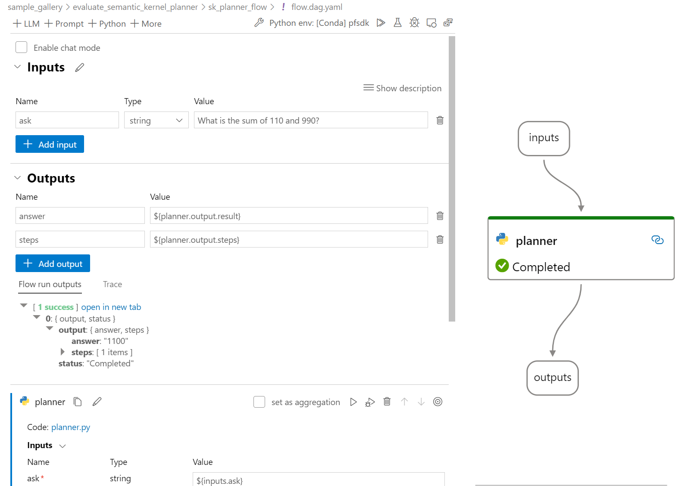

# Tutorial: Evaluate Semantic Kernel Planner

## Overview

Navigating the dynamic terrain of AI orchestration requires precise evaluation of your plugins and planners. However, as more plugins are added to planners, ensuring their correct operation becomes crucial. While previously this was a manual and time-consuming task, the prompt flow now enables you to automate this process.

This is where the integration of [semantic kernel](https://github.com/microsoft/semantic-kernel) and [prompt flow](https://github.com/microsoft/promptflow) comes into play. It allows you to not only orchestrate automatically functions on the fly using planner, but also to evaluate your semantic kernel plugins and planners comprehensively for higher quality control and tunning.


In this tutorial, we guide you on how to:

* Develop a flow: We give the sample flow with Semantic Kernel planner capability including SK curated plugins and custom plugins.
* Benchmark dataset preparation: You can leverage the [Golden dataset](../golden_dataset/copilot-golden-dataset-creation-guidance.md) to prepare your benchmark dataset.
* Execute batch tests: We walk you through the pf batch test to generate output of your multi-rows dataset.
* Conduct evaluations: An evaluation flow provided finally, we show you how to quantitatively assess the *fullfillment ratio* of your planners.

By following this tutorial, you will gain a practical understanding of the Semantic Kernel Planner and how to effectively incorporate it with Prompt Flow.

## Prerequisites

To go through this tutorial you should:

1. Install dependencies
    ```bash
    cd ./sample_gallery/evaluate_semantic_kernel_planner/source_file
    pip install -r requirements.txt
    ```

2. (Optional but highly recommended) Install and configure [Prompt flow for VS Code extension](https://marketplace.visualstudio.com/items?itemName=prompt-flow.prompt-flow) follow [Quick Start Guide](https://microsoft.github.io/promptflow/how-to-guides/quick-start.html). 

    (This extension is optional but highly recommended for flow development and debugging.)

## Develop a flow with Semantic Kernel Planner

You may have already learned how to [create a prompt flow from scratch](https://microsoft.github.io/promptflow/how-to-guides/quick-start.html). For semantice kernel planner running within prompt flow, it's available to run any semantic kernel python code in the **Python node** in the prompt flow.

In this tutorial, we have already prepared a sample flow for you to get started. You can find the flow file [sk_planner_flow.yaml](./sk_planner_flow/sk_planner_flow.yaml) in the [sk_planner_flow](./sk_planner_flow) folder. 
- [sk_planner_flow.yaml](./sk_planner_flow/sk_planner_flow.yaml): This is the flow definition yaml file, contains the input, output and linking relationship of the nodes.
    - This flow contains a planner node (python) with a semantic kernel planner. The entry point of the planner is [sk_planner.py](./sk_planner_flow/sk_planner.py) file.
- [skills](./sk_planner_flow/skills/): This is the folder contains the semantic kernel custom plugins files.

With the prompt flow VS Code extension, you'll be able to view this flow in a visual editor, the flow in the visual editor in VS code looks like this:



### Initialize a flow based on existing code
In other case, if you already have [Semantic kernel python script](./source_file/sk_planner.py), it's also straightforward to build a prompt flow from existing code. You can construct a chat flow either by composing the YAML file or using the visual editor of Visual Studio Code extension and create a few wrappers for existing code.

```python
# function in the sk_planner.py to be wrapped
def sk_planner(ask: str, model: str, aoai_deployment: str, api_version: str) -> object:
  llm_service = "AzureOpenAI"
  deployment_name, api_key, endpoint = sk.azure_openai_settings_from_dot_env(include_deployment=False)
  ...
```

For example, build wrapper of the planner tool:

```bash
cd ./sample_gallery/evaluate_semantic_kernel_planner/source_file
pf flow init --flow ./ --entry sk_planner.py --function sk_planner
```

**⚠ Note** 

In the following steps, we will demonstrate the batch test and evaluation based on the [sample flow](./sk_planner_flow). If you want to use your own flow converted following the init command above, please make sure you have the same flow input and output structure as the sample flow, and using the same connection(see below for more details on connection).

### Connection setup
In the Semantic Kernel Planner, we need to the LLM keys in the kernel to connect to the LLM resources, for example:

```python
import semantic_kernel as sk

# get the LLM keys from the .env file
deployment_name, api_key, endpoint = sk.azure_openai_settings_from_dot_env()
```

We're using Azure OpenAI in this example, so we assume we have the following [.env](./source_file/.env) file for :

```bash
AZURE_OPENAI_ENDPOINT=<your azure openai endpoint>
AZURE_OPENAI_API_KEY=<your api key>
```
In prompt flow we use **Connection** to manage access to external services like OpenAI and support passing configuration object into flow so that you can do experimentation easier. And you can run the following command to easily create a connection based on the exsiting .env file:

Note: 
- Make sure you have your own key and endpoint value overrided in the [.env](./source_file/.env) file.
- Overrides specified by --set will be ignored

```bash
cd ./sample_gallery/evaluate_semantic_kernel_planner/source_file
pf connection create -f .env --name <connection_name>
```

## Benchmark dataset preparation

For evaluating the generation of the planner, we need to prepare a banchmark dataset. 

A small dataset can be found here: [data.jsonl](./sk_planner_flow/data.jsonl) which contains around 12 lines of test dataset：
- "ask": Questions for the semantic kernel planner in the flow, the main flow run to generate plan and answers. 
- "answer": The correct ground truth answers for each questions.
    - For the math questions, we do have the ground truth answers, so that we can evaluate the correctness of the generated answer between the ground truth answer.
    - For some write and summarize questions, which do not have a atandard answer. So we just mark them as `no standard answer` in the `answer` column. In this case, we can evaluate the fullfillment ratios, which measures the percentage of your criteria that were met, to evaluate question contained steps/plans and answer.

Let's update the data.jsonl file with data that we can use to evaluate our plugin.

## Execute batch tests

## Conduct evaluations

## Next Steps
* Golden dataset preparation: We show you how to prepare a golden dataset for the planner evaluation.
